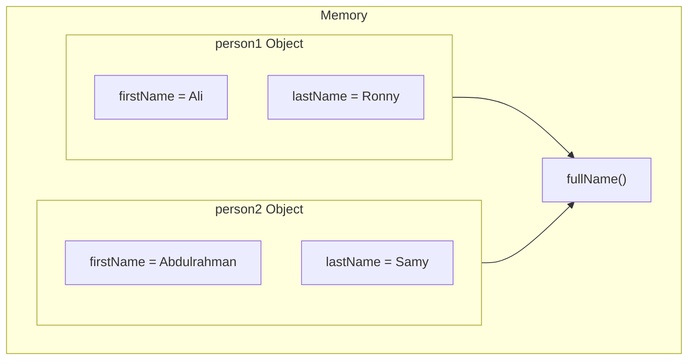

# Objects in Memory

## Creating Objects

You can create multiple objects from the same class.

Each object gets its own space for its data members.

## What Happens When an Object Is Created?

When an object is created:

1. The object gets its own memory for its data members.
2. Each object has its own copy of the data members.
3. Member functions are shared among objects.
4. The same member function code can be used by multiple objects.

## Example

```cpp
class Person
{
public:
    string firstName;
    string lastName;

    string fullName()
    {
        return firstName + " " + lastName;
    }
};

int main()
{
    Person person1;
    Person person2;

    person1.firstName = "Ali";
    person1.lastName = "Ronny";

    person2.firstName = "Abdulrahman";
    person2.lastName = "Samy";
}
```

## Memory Concept

### In this example:

- `Person1` has its own data:
    - firstName → "Ali"
    - lastName → "Ronny"

- `Person2` has its own data:
    - firstName → "Abdulrahman"
    - lastName → "Samy"

The two objects have separate data.

However, both objects use the same `fullName()` member function.

## Key Point

Each object has its own copy of the object's data members.

Member functions are shared conceptually between objects; the same function code is used when different objects call the function.

#### Simple Rule

    - Each object → its own data member.

    - Objects of the same class → use the same member function code.


## Memory Diagram

